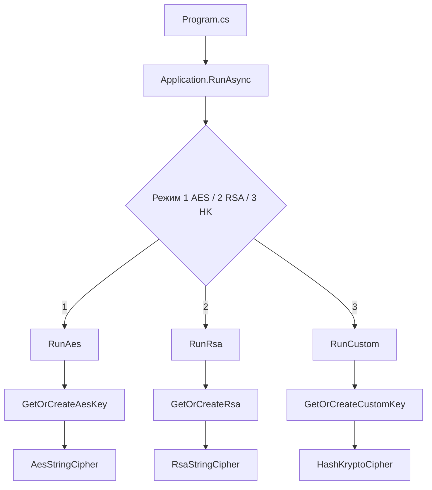

# HashKrypto.Console — шифрование строк в консоли

Консольное приложение на C# для **симметричного** (AES-256), **асимметричного** (RSA-2048) и **экспериментальной схемы HashKrypto** (свой потоковый шифр поверх SHA-256) для введённой строки. Тип шифрования выбирается в меню при каждой операции.

## Требования

- [.NET SDK](https://dotnet.microsoft.com/download) (в проекте указан `net10.0`; при необходимости замените `TargetFramework` в `.csproj` на установленную у вас версию, например `net8.0`).

## Запуск

```bash
dotnet run --project HashKrypto.Console.csproj
```

Сборка:

```bash
dotnet build HashKrypto.Console.csproj
```

## Как пользоваться

После запуска программа выводит меню в два шага.

1. **Тип шифрования**
   - `1` — AES-256  
   - `2` — RSA-2048  
   - `3` — HashKrypto (своя схема, отдельный ключ сеанса)  
   - `0` — выход (пустая строка тоже завершает работу)

2. **Действие**
   - `1` — зашифровать (ввод открытого текста)  
   - `2` — расшифровать (ввод строки в Base64, которую вы получили при шифровании)

Результат шифрования всегда выводится как **одна строка Base64**. Для расшифровки нужно вставить её целиком (можно в одну строку).

## Важно про ключи

Ключи **не сохраняются на диск** и живут только **в памяти текущего запуска** программы (`CryptoSession`):

- **AES** — при первом обращении к режиму AES генерируется случайный ключ 32 байта (256 бит). Все последующие операции AES в этом сеансе используют тот же ключ. После закрытия программы расшифровать старый шифротекст без того же ключа невозможно.
- **HashKrypto** — свой ключ 32 байта, **независимый от ключа AES** (режим `3`). Тот же сеанс: без этого ключа расшифровка невозможна.
- **RSA** — при первом обращении к режиму RSA создаётся пара ключей **2048 бит**. Шифрование идёт через **открытый** ключ, расшифрование — через **закрытый** из той же пары в памяти.

Поэтому **зашифровать и расшифровать одни и те же данные нужно в одном запуске** приложения (или позже придётся самостоятельно реализовать экспорт/импорт ключей — в текущей версии этого нет).

## Как устроено AES

Реализация: `AesStringCipher.cs`.

- Алгоритм: **AES-256**, режим **CBC**, дополнение **PKCS7**.
- Для каждого шифрования генерируется новый случайный **IV** (вектор инициализации), 16 байт.
- В Base64 кодируется **один бинарный пакет**: сначала 16 байт IV, затем шифротекст. При расшифровке IV отделяется от данных, затем выполняется `DecryptCbc`.

Смысл: один и тот же ключ, но разные IV — дают разный шифротекст для одинаковых сообщений (базовая защита от шаблонов).

## Как устроено RSA

Реализация: `RsaStringCipher.cs`.

- Ключ: **2048 бит**, дополнение **OAEP** с хэшем **SHA-256** (`RSAEncryptionPadding.OaepSHA256`).
- Открытый текст кодируется в **UTF-8**; шифротекст — одна порция байт, длина равна размеру модуля ключа (для 2048 бит — 256 байт), затем **Base64** для удобного ввода-вывода в консоли.

**Ограничение длины:** RSA шифрует только короткие сообщения. Максимальная длина открытого текста в байтах (UTF-8) задаётся формулой OAEP: `k − 2h − 2`, где `k` — размер ключа в байтах, `h` — размер хэша SHA-256 (32 байта). Для 2048 бит это **190 байт**. Длиннее — программа сообщит об ошибке и предложит использовать AES.

## Схема HashKrypto (своя)

Реализация: `HashKryptoCipher.cs`. Это **не** стандартизированный алгоритм и **не рекомендуется** для защиты реальных секретов: нет независимого криптоанализа, нет гарантий стойкости. Зато наглядно показывает идею **потокового шифра** и обратимых преобразований.

**Формат пакета (до Base64):** `nonce (8 байт) ‖ шифротекст`. Для каждого шифрования nonce новый (случайный).

**Шаги шифрования:**

1. Строка переводится в **UTF-8**.
2. **Pre-mix:** каждый байт с индексом `i` превращается в `plain[i] ⊕ key[i mod 32] ⊕ (i + nonce[i mod 8])` (арифметика по модулю 256 в типе `byte`). Обратная операция совпадает с прямой (XOR сам к себе обратим).
3. **Циклический сдвиг влево (ROL):** на `r = (nonce[i mod 8] + i) mod 8` битов — зависит от позиции и nonce, чтобы одинаковые байты в разных местах сообщения смешивались по-разному. Расшифрование: **ROR** на тот же `r`.
4. **Перестановка полубайтов (nibble swap):** старшие и младшие 4 бита меняются местами; повторное применение возвращает исходный байт.
5. **Поток ключей:** для `counter = 0, 1, 2, …` считается `SHA256("HK" ‖ key ‖ nonce ‖ counter₆₄)` (little-endian 64-битный счётчик в конце preimage); блоки SHA-256 склеиваются, пока не наберётся длина сообщения. Идея близка к **потоковому шифру в стиле CTR**, но с фиксированной «солёной» строкой `HK` и своим форматом preimage.
6. Каждый байт после шагов 2–4 **XOR** с соответствующим байтом потока.

**Расшифрование:** XOR с тем же потоком → обратный nibble swap → **ROR** с тем же `r` → pre-mix (тот же XOR).

Криптографическая «тяжесть» здесь в основном от **SHA-256** как псевдослучайного генератора; остальное — простое смешивание. Для продакшена используйте **AES-GCM** или **ChaCha20-Poly1305**.

## Структура проекта

| Файл | Назначение |
|------|------------|
| `Program.cs` | Точка входа, вызов `Application.RunAsync`. |
| `Application.cs` | Цикл меню, ввод-вывод, вызов AES, RSA или HashKrypto. |
| `CryptoSession.cs` | Ключи AES и HashKrypto (по 32 байта), экземпляр RSA на время процесса. |
| `AesStringCipher.cs` | Шифрование/расшифрование строки AES-256-CBC. |
| `RsaStringCipher.cs` | Шифрование/расшифрование короткой строки RSA-OAEP-SHA256, расчёт лимита длины. |
| `HashKryptoCipher.cs` | Экспериментальная схема: pre-mix, ROL по позиции, nibble swap, XOR с потоком из SHA-256. |

---

## Как работает код (пошагово)

Ниже — цепочка вызовов и что происходит с данными на каждом шаге.

### 1. Точка входа (`Program.cs`)

При старте процесса CLR вызывает неявный `Main`. В шаблоне с top-level statements выполняется одна строка:

```csharp
return await Application.RunAsync(args);
```

Код возвращает **код выхода процесса** (`int`): `0` после нормального завершения цикла меню. Аргументы командной строки `args` в текущей версии **не используются** — всё взаимодействие идёт через консольный ввод.

### 2. Цикл меню (`Application.RunAsync`)

1. Устанавливается `Console.OutputEncoding` в UTF-8, чтобы кириллица и любые символы Unicode корректно отображались в терминале.
2. В бесконечном `while` дважды читается `Console.ReadLine()`:
   - выбор режима: AES (`1`), RSA (`2`) или выход (`0` / пустая строка);
   - выбор действия: зашифровать (`1`) или расшифровать (`2`).
3. В зависимости от выбора вызывается `RunAes(encrypt)` или `RunRsa(encrypt)`.
4. Исключения перехватываются общим `catch`: пользователь видит сообщение об ошибке, цикл меню продолжается.

`RunAes`, `RunRsa` и `RunCustom` только запрашивают строку и делегируют криптографию классам ниже.

### 3. Где берутся ключи (`CryptoSession`)

Это статический «сейф» на время работы программы:

| Поле | Когда создаётся | Как |
|------|-----------------|-----|
| `_aesKey` | При первом вызове `GetOrCreateAesKey()` | Массив 32 байта, заполняется криптографически стойким генератором `RandomNumberGenerator.Fill` |
| `_customKey` | При первом вызове `GetOrCreateCustomKey()` | Отдельные 32 байта для режима HashKrypto (не совпадают с AES, если не совпали случайно) |
| `_rsa` | При первом вызове `GetOrCreateRsa()` | `RSA.Create(2048)` — в памяти появляется пара **открытый + закрытый** ключ |

Повторные вызовы возвращают **те же** объекты. AES и HashKrypto в одном процессе используют **разные** ключи; RSA — одна пара на сеанс.

### 4. Шифрование AES (`AesStringCipher.Encrypt`)

Цепочка преобразований:

1. **Проверка ключа** — длина ровно 32 байта (AES-256).
2. **`Aes.Create()`** — создаётся объект настроек AES в BCL.
3. **Параметры:** `KeySize = 256`, режим `CBC`, дополнение `PKCS7`. Ключ подставляется из сессии; вызывается **`GenerateIV()`** — случайные 16 байт (размер блока AES).
4. **Строка → байты:** `Encoding.UTF8.GetBytes(plaintext)` — дальше работа идёт с байтами, не с символами.
5. **`EncryptCbc(plain, aes.IV)`** (API .NET): внутри библиотеки выполняется:
   - дополнение последнего блока по PKCS7 до кратности 16 байтам;
   - режим CBC: первый блок XOR с IV, затем каждый следующий блок XOR с предыдущим шифроблоком, на каждом шаге применяется сам алгоритм AES (подстановки, сдвиги, MixColumns и т.д. — стандарт FIPS).
6. **Сборка пакета:** в массив записывается подряд `[IV (16 байт)][шифротекст]`. IV передаётся **в открытом виде** — так и принято в CBC: секретность даёт ключ, уникальность результата — случайный IV.
7. **`Convert.ToBase64String(packet)`** — бинарный пакет превращается в печатаемую строку для консоли.

### 5. Расшифрование AES (`AesStringCipher.Decrypt`)

1. **`Convert.FromBase64String`** — обратно в байты.
2. Если длина ≤ 16 байт, данных недостаточно (нужен хотя бы IV) — выбрасывается `CryptographicException`.
3. Первые **16 байт** — IV, всё остальное — шифротекст.
4. Снова настраивается AES с тем же ключом, **`DecryptCbc`**: обратный порядок CBC и снятие PKCS7.
5. **`Encoding.UTF8.GetString`** — байты снова становятся строкой C#.

Если Base64 битый, ключ другой или данные повреждены — `DecryptCbc` или декодер UTF-8 могут завершиться ошибкой.

### 6. Шифрование RSA (`RsaStringCipher.Encrypt`)

1. Строка снова переводится в **UTF-8 байты**.
2. **`GetMaxPlaintextBytes`** считает максимум для OAEP-SHA256: `k − 2h − 2` (для 2048 бит: `256 − 64 − 2 = 190`). Если сообщение длиннее — выбрасывается `InvalidOperationException` **до** вызова криптографии.
3. **`rsaPublic.Encrypt(plain, RSAEncryptionPadding.OaepSHA256)`**:
   - внутри используется **открытый** ключ (модуль `n` и экспонента `e`);
   - OAEP: к сообщению добавляется маска на основе SHA-256 (случайность и структура по стандарту PKCS#1 v2);
   - результат приводится к длине модуля в байтах — для 2048 бит это **ровно 256 байт** шифротекста независимо от длины открытого текста (в пределах лимита).
4. Эти 256 байт кодируются в **Base64** для вывода.

В вашем приложении в `RSA` лежит полная пара ключей, но метод `Encrypt` криптографически опирается только на публичную часть; закрытый ключ для шифрования не нужен.

### 7. Расшифрование RSA (`RsaStringCipher.Decrypt`)

1. Base64 → байты (ожидается длина, совпадающая с размером ключа, например 256).
2. **`rsaPrivate.Decrypt(cipher, RSAEncryptionPadding.OaepSHA256)`** — используется **закрытый** ключ; обратные преобразования OAEP и возврат исходных байт.
3. Байты интерпретируются как UTF-8 и превращаются в строку.

Если шифротекст создан другим ключом или обрезан — расшифровка завершится исключением.

### 8. HashKrypto (`HashKryptoCipher`)

Кратко по коду (подробности — в разделе [«Схема HashKrypto»](#схема-hashkrypto-своя) выше):

1. Генерируется **nonce** 8 байт (`RandomNumberGenerator`).
2. **Pre-mix:** XOR байта открытого текста с байтами ключа и с `(i + nonce[i mod 8])`.
3. **ROL:** циклический сдвиг влево на `((nonce[i mod 8] + i) mod 8)` бит.
4. **Nibble swap** по каждому байту.
5. **Поток:** подряд считаются блоки `SHA256("HK" ‖ key ‖ nonce ‖ counter)`; из хэшей нарезается поток длины сообщения.
6. Шифротекст = XOR результата шага 4 с потоком; в пакет добавляется nonce в начало, затем **Base64**.

Расшифрование: XOR с тем же потоком → nibble swap → **ROR** с тем же числом бит → pre-mix.

### 9. Связь выбора в меню и вызовов



### 10. Что сознательно не сделано в этом учебном проекте

- Нет **аутентификации** шифротекста (MAC / AEAD вроде AES-GCM): CBC + PKCS7 не гарантируют, что данные не подменили; для продакшена часто используют GCM или отдельный HMAC. У HashKrypto тоже **нет** проверки целостности.
- Нет **экспорта ключей** в файлы — после перезапуска программы старые шифротексты AES/RSA/HashKrypto из этого приложения не восстановить.
- **RSA** не подходит для длинных сообщений без гибридной схемы (сессионный AES-ключ, зашифрованный RSA).
- **HashKrypto** — игрушечная схема; для реальных данных используйте стандартизированные примитивы.

---

## Краткая схема потока данных

```text
Пользователь → меню (AES | RSA | HashKrypto) → зашифровать | расшифровать → ввод текста/Base64
                                                                    ↓
AES:        UTF-8 → CBC + PKCS7 → пакет [IV‖cipher] → Base64
RSA:        UTF-8 → OAEP-SHA256 → cipher (фикс. длина) → Base64
HashKrypto: UTF-8 → pre-mix → ROL → nibble swap → XOR SHA256-поток → пакет [nonce‖cipher] → Base64
```

Если нужна передача шифротекста между разными запусками или машинами, потребуется договориться о хранении/обмене ключами (и, для RSA, обычно — гибридная схема AES+RSA для длинных данных). Текущий проект рассчитан на обучение и эксперименты в рамках одного сеанса.
